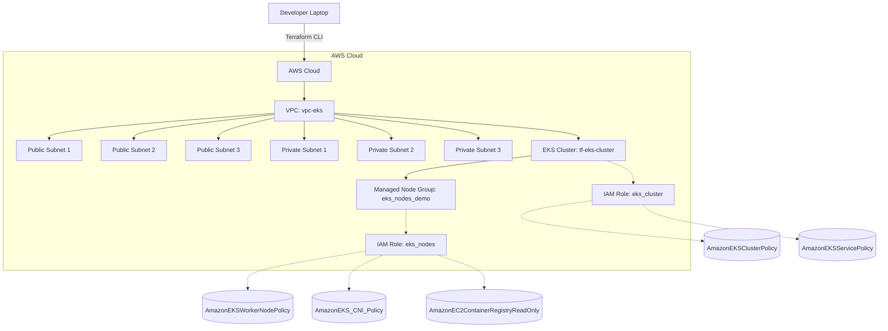

# 🚀 AWS EKS Cluster Deployment using Terraform

## 📘 Overview
This project automates the deployment of an **Amazon Elastic Kubernetes Service (EKS)** cluster on **AWS** using **Terraform**.  
It provisions all essential components — including **VPC**, **subnets**, **IAM roles**, **EKS control plane**, and **managed node groups** — entirely through Infrastructure as Code (IaC).  

By using Terraform, the deployment process becomes **repeatable**, **version-controlled**, and **scalable** — ideal for both learning and production-grade Kubernetes setups.

---

## 🧭 Architecture Diagram

### Mermaid Diagram (Rendered on GitHub)


---

## 🏗️ Architecture Components

| Component       | Description                                                              |
| --------------- | ------------------------------------------------------------------------ |
| **VPC**         | Created using the official Terraform AWS VPC module                      |
| **Subnets**     | Three public and three private subnets across two availability zones     |
| **IAM Roles**   | Configured for EKS control plane and EC2 worker nodes                    |
| **EKS Cluster** | Managed Kubernetes control plane                                         |
| **Node Group**  | Managed worker nodes with auto-scaling configuration                     |
| **Terraform**   | Infrastructure as Code (IaC) tool to define and manage all AWS resources |

**AWS Services Used:**
Amazon EKS • Amazon EC2 • Amazon VPC • AWS IAM

---

## 📂 Project Structure

```
├── ekscluster.tf        # EKS Cluster and Node Group resources
├── iam.tf               # IAM roles and policies for EKS and nodes
├── provider.tf          # AWS provider configuration
├── variables.tf         # Input variables for region, cluster name, etc.
├── vpc.tf               # Terraform AWS VPC module for networking
├── ekscluster.tfstate   # Terraform state file for direct deployment
└── README.md

```
---

## ⚙️ Prerequisites

Before starting, ensure you have:

* ✅ AWS Account with admin permissions
* ✅ Terraform **v1.3+** installed
* ✅ AWS CLI configured (`aws configure`)
* ✅ kubectl installed to manage Kubernetes cluster

**Verify installations:**

```bash
terraform -v
aws --version
kubectl version --client
```

---

## 🚀 Deployment Steps

### 1️⃣ Clone the Repository

```bash
git clone https://github.com/<your-username>/<repo-name>.git
cd <repo-name>
```

### 2️⃣ Initialize Terraform

```bash
terraform init
```

### 3️⃣ Validate Configuration

```bash
terraform validate
```

### 4️⃣ Preview the Plan

```bash
terraform plan
```

### 5️⃣ Deploy the Infrastructure

```bash
terraform apply
```

Confirm with **`yes`** when prompted.

---

## 🔗 Connect to EKS Cluster

After successful deployment, configure `kubectl` to connect with your new cluster:

```bash
aws eks --region eu-west-1 update-kubeconfig --name tf-eks-cluster
```

Verify connection:

```bash
kubectl get nodes
```

---

## 🧾 Outputs

Once deployment completes, Terraform displays:

| Output              | Description                     |
| ------------------- | ------------------------------- |
| `eks_cluster_name`  | Name of the created EKS cluster |
| `node_group_name`   | Name of the worker node group   |
| `vpc_id`            | ID of the provisioned VPC       |
| `public_subnet_ids` | List of public subnet IDs       |

These outputs can be used in CI/CD pipelines or monitoring setups.

---

## 🧹 Cleanup

To avoid incurring costs, destroy all created AWS resources after testing:

```bash
terraform destroy
```

---

## 🔒 Security Best Practices

* Implements **least privilege** IAM roles
* No hard-coded credentials — uses AWS CLI or environment variables
* Sensitive data is not stored in Terraform configuration
* Store Terraform state remotely (e.g., **S3 + DynamoDB**) for team collaboration

---

## ⚙️ Input Variables

| Variable       | Description               | Default          |
| -------------- | ------------------------- | ---------------- |
| `cluster-name` | Name of the EKS cluster   | `tf-eks-cluster` |
| `AWS_REGION`   | AWS region for deployment | `eu-west-1`      |

---

## 🛠️ Future Enhancements

* Integrate **Helm charts** for application deployment
* Add **Terraform remote backend (S3 + DynamoDB)**
* Automate pipeline using **GitHub Actions / Jenkins**
* Implement **autoscaling** for EKS Node Groups
* Add monitoring via **Prometheus & Grafana**

---

## 👨‍💻 Author

**Yash Patil**
🎓 B.Tech in Computer Engineering | ☁️ Cloud & Cybersecurity Enthusiast
📍 Pune, India

🔗 [GitHub](https://github.com/yashpatil118) • [LinkedIn](https://linkedin.com/in/yash-patil-069820252)

---

⭐ *If you found this project helpful, consider giving it a star on GitHub!*


---
